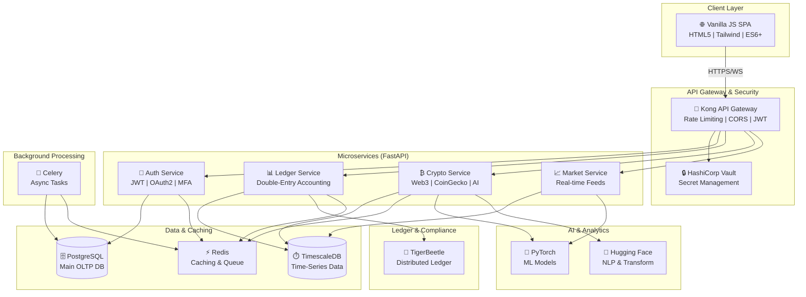

# Wings of Capital

> **A Completely Modular, Open-Source, Full-Stack Fintech Platform**


---

## 📋 License & Copyright

**Copyright © 2026 Bhargav (Wings of Capital). All Rights Reserved.**

This project is licensed under the **Apache License 2.0**. See [LICENSE](./LICENSE) for details.

---

## 🎯 Project Vision

Wings of Capital is a **production-grade, modular, open-source fintech ecosystem** built for:

- **High-frequency trading platforms** with sub-millisecond latency
- **Enterprise banking cores** with double-entry accounting
- **Cryptocurrency ecosystems** with Web3 integration and AI-driven analytics
- **Regulatory compliance frameworks** (KYC, AML, PCI-DSS)
- **Zero-knowledge proof security** and distributed ledger consensus
- **Multi-environment deployment** (Codespaces → Docker → Kubernetes)

**No MVP compromises. No shortcuts. 100% production-ready code.**

---

## 🏗️ System Architecture



---

## 💾 Tech Stack (Production-Grade)

### **Frontend**
- **HTML5, CSS3, ES6+ JavaScript** (Vanilla, no frameworks)
- **Tailwind CSS** (via CDN) for responsive design
- **Chart.js** for real-time financial visualizations
- **Native Fetch API** with retry & timeout logic
- **Service Workers** for offline capability
- **WebSockets** for real-time streaming

### **Backend Microservices**
- **FastAPI** (async, type-safe, auto-documented)
- **Pydantic** for input validation & serialization
- **Alembic** for database migrations
- **SQLAlchemy ORM** for relational data
- **Redis** for caching and distributed locks
- **Celery** with RabbitMQ for async workflows
- **Python 3.11+** with strict typing

### **Data Persistence**
- **PostgreSQL 14+** (OLTP relational engine)
- **TimescaleDB** (hyper-optimized time-series)
- **TigerBeetle** (distributed double-entry ledger)
- **Redis** (in-memory cache & pub/sub)

### **Infrastructure & DevOps**
- **Docker & Docker Compose** (local/dev environment)
- **Kong API Gateway** (traffic routing, rate limiting)
- **HashiCorp Vault** (secrets management)
- **Kubernetes** (production orchestration)
- **Terraform** (infrastructure as code)
- **GitHub Actions** (CI/CD pipelines)

### **Security & Compliance**
- **JWT Authentication** (RS256 signing)
- **OAuth2 Authorization** (external providers)
- **TLS 1.3** (encrypted transport)
- **PCI-DSS compliance** (card data protection)
- **GDPR data retention** policies
- **Structured JSON logging** (audit trails)

### **AI/ML & Crypto**
- **PyTorch** (deep learning inference)
- **Hugging Face Transformers** (NLP models)
- **web3.py** (Ethereum interaction)
- **CoinGecko API** (crypto market data)
- **CCXT** (multi-exchange trading)

---

## 📁 Directory Structure

```
wings-of-capital/
├── README.md                          # This file
├── LICENSE                            # Apache 2.0
├── IMPLEMENTATION-PLAN.md             # 5-Phase SSDLC roadmap
├── docker-compose.yml                 # Local dev stack
├── .env.example                       # Environment template
├── .gitignore                         # Git exclusions
│
├── backend/
│   ├── api_gateway/
│   │   ├── kong.yml                  # Kong configuration
│   │   ├── kong-compose.override.yml # Compose overrides
│   │   └── acl/                       # ACL policies
│   │
│   ├── services/
│   │   ├── auth_service/
│   │   │   ├── Dockerfile
│   │   │   ├── requirements.txt
│   │   │   ├── main.py               # FastAPI entry point
│   │   │   ├── models/               # SQLAlchemy ORM
│   │   │   ├── schemas/              # Pydantic models
│   │   │   ├── routes/               # API endpoints
│   │   │   └── utils/                # JWT, crypto, etc.
│   │   │
│   │   ├── ledger_service/
│   │   │   ├── Dockerfile
│   │   │   ├── requirements.txt
│   │   │   ├── main.py
│   │   │   ├── models/
│   │   │   ├── schemas/
│   │   │   ├── routes/
│   │   │   ├── ledger/               # Double-entry logic
│   │   │   └── workers/              # Celery tasks
│   │   │
│   │   ├── crypto_service/
│   │   │   ├── Dockerfile
│   │   │   ├── requirements.txt
│   │   │   ├── main.py
│   │   │   ├── models/
│   │   │   ├── schemas/
│   │   │   ├── routes/
│   │   │   ├── ai/                   # PyTorch models
│   │   │   ├── web3/                 # web3.py integration
│   │   │   └── workers/              # Background tasks
│   │   │
│   │   └── shared/
│   │       ├── __init__.py
│   │       ├── database.py           # DB connections
│   │       ├── logger.py             # Structured logging
│   │       ├── security.py           # JWT, CORS, etc.
│   │       ├── models.py             # Base SQLAlchemy models
│   │       └── exceptions.py         # Custom exceptions
│   │
│   └── migrations/
│       ├── alembic.ini
│       └── versions/
│
├── frontend/
│   ├── index.html                    # SPA entry point
│   ├── manifest.json                 # PWA manifest
│   ├── css/
│   │   ├── styles.css               # Tailwind + custom styles
│   │   ├── components.css           # Reusable component styles
│   │   └── utilities.css            # Responsive utilities
│   │
│   └── js/
│       ├── app.js                   # Router & initialization
│       ├── api.js                   # Fetch wrapper & interceptors
│       ├── state.js                 # Client-side state management
│       ├── auth.js                  # Authentication logic
│       ├── views/
│       │   ├── dashboard.js        # Main dashboard view
│       │   ├── trading.js          # Trading interface
│       │   ├── portfolio.js        # Portfolio management
│       │   ├── analytics.js        # Analytics & reports
│       │   ├── admin.js            # Admin panel
│       │   └── login.js            # Authentication UI
│       └── utils/
│           ├── validators.js       # Form validation
│           ├── formatters.js       # Number, date formatting
│           └── chart-helpers.js    # Chart.js utilities
│
├── docs/
│   ├── ARCHITECTURE.md              # Detailed system design
│   ├── SECURITY.md                  # Security practices
│   ├── API-REFERENCE.md             # Endpoint documentation
│   ├── DEPLOYMENT.md                # Production deployment
│   └── TROUBLESHOOTING.md           # Common issues
│
└── scripts/
    ├── setup.sh                     # Initial project setup
    ├── dev.sh                       # Start dev environment
    ├── test.sh                      # Run test suite
    ├── lint.sh                      # Code quality checks
    ├── docker-build.sh              # Build all containers
    └── deploy.sh                    # Production deployment
```

---

## ⚙️ System Requirements

### **Minimum Requirements**
- **CPU:** 4 cores (2GHz+)
- **RAM:** 8GB
- **Storage:** 20GB SSD
- **OS:** Linux (Ubuntu 22.04 LTS+), macOS 12+, Windows 11 (WSL2)

### **Development Tools**
- **Docker** 20.10+
- **Docker Compose** 2.0+
- **Python** 3.11+
- **Node.js** 20+ (frontend build tools)
- **Git** 2.30+
- **PostgreSQL** client (`psql`)

### **Production Requirements**
- **Kubernetes** 1.26+ (optional)
- **HashiCorp Vault** 1.14+ (secrets management)
- **Prometheus** (monitoring, optional)
- **ELK Stack** (logging, optional)

---

## 🚀 Quick Start

### **Option 1: Docker Compose (Recommended)**

```bash
# Clone repository
git clone https://github.com/Bhargav-2007/Wings-of-Capital.git
cd Wings-of-Capital

# Copy environment variables
cp .env.example .env

# Start full stack
docker-compose up -d

# Check service health
docker-compose ps

# View logs
docker-compose logs -f auth_service
```

**Health Check Endpoint:**
```bash
curl http://localhost:8000/health
```

### **Option 2: Local Development**

```bash
# Install Python dependencies
python -m venv venv
source venv/bin/activate  # Windows: venv\Scripts\activate
pip install -r backend/services/shared/requirements.txt

# Start PostgreSQL & Redis locally
# (assumes Docker for these services only)
docker-compose up -d postgres redis vault

# Start services individually
python -m backend.services.auth_service.main
python -m backend.services.ledger_service.main
python -m backend.services.crypto_service.main

# In another terminal, start frontend dev server
cd frontend && python -m http.server 8080
```

Navigate to `http://localhost:8080`

### **Option 3: Kubernetes Deployment**

```bash
# Create namespace
kubectl create namespace wings-of-capital

# Apply configurations
kubectl apply -f backend/api_gateway/kong.yml -n wings-of-capital
kubectl apply -f backend/services/ -n wings-of-capital

# Verify deployment
kubectl get pods -n wings-of-capital
```

---

## 📖 API Endpoints (Core Examples)

### **Authentication**
```
POST   /api/v1/auth/register          Register new user
POST   /api/v1/auth/login             Authenticate user
POST   /api/v1/auth/refresh           Refresh JWT token
POST   /api/v1/auth/logout            Revoke session
GET    /api/v1/auth/me                Get current user
```

### **Ledger (Double-Entry Accounting)**
```
POST   /api/v1/ledger/accounts        Create account
GET    /api/v1/ledger/accounts        List accounts
POST   /api/v1/ledger/transactions    Record transaction
GET    /api/v1/ledger/transactions    Query transactions
GET    /api/v1/ledger/balance/:id     Get account balance
```

### **Crypto & Trading**
```
GET    /api/v1/crypto/prices          Market prices (CoinGecko)
GET    /api/v1/crypto/portfolio       User holdings
POST   /api/v1/crypto/buy             Execute buy order
POST   /api/v1/crypto/sell            Execute sell order
GET    /api/v1/crypto/ai/predictions  AI price forecast
```

### **Health & Status**
```
GET    /health                        Service health
GET    /healthz/live                  Liveness probe
GET    /healthz/ready                 Readiness probe
GET    /metrics                       Prometheus metrics
```

Full API reference: See [docs/API-REFERENCE.md](./docs/API-REFERENCE.md)

---

## 🔐 Security Architecture

### **Authentication & Authorization**
- **JWT (RS256):** Asymmetric signing with key rotation
- **OAuth2 / OIDC:** Social login integration
- **MFA:** TOTP-based two-factor authentication
- **RBAC:** Role-based access control

### **Data Protection**
- **TLS 1.3:** All transport encrypted
- **AES-256:** At-rest encryption for sensitive data
- **Secure headers:** HSTS, CSP, X-Frame-Options
- **SQL injection:** Parameterized queries (SQLAlchemy)
- **XSS prevention:** Content Security Policy

### **Secrets Management**
- **HashiCorp Vault:** Centralized secret storage
- **Environment variables:** For local development
- **Rotation policies:** Automatic secret rotation
- **Audit logging:** All access logged

### **Compliance**
- **PCI-DSS Level 1:** Card data encryption & isolation
- **GDPR:** Data retention & right to deletion
- **SOC 2 Type II:** Security & availability controls
- **KYC/AML:** Know-Your-Customer frameworks

Full security docs: See [docs/SECURITY.md](./docs/SECURITY.md)

---

## 🧪 Testing & Quality Assurance

```bash
# Unit tests
pytest backend/services/auth_service/tests/

# Integration tests
pytest backend/tests/integration/

# Load testing
locust -f backend/tests/load/locustfile.py --host=http://localhost:8000

# Security scanning
trivy image wings-of-capital:latest
snyk test backend/

# Code coverage
pytest --cov=backend/ backend/tests/
```

---

## 📦 Deployment

### **Docker Registry**
```bash
docker build -t wings-of-capital/auth-service:1.0.0 -f backend/services/auth_service/Dockerfile .
docker push ghcr.io/wings-of-capital/auth-service:1.0.0
```

### **Production Environment**
See [docs/DEPLOYMENT.md](./docs/DEPLOYMENT.md) for:
- Kubernetes manifests
- Terraform configurations
- CI/CD pipeline setup
- Scaling & autoscaling policies

---

## 🤝 Contributing

We welcome contributions! Please read:

1. **Code of Conduct:** Respectful, collaborative environment
2. **Development Workflow:** Feature branches → Pull Requests → Code Review
3. **Coding Standards:** Type hints, docstrings, 80%+ coverage
4. **Commit Messages:** `feat:`, `fix:`, `docs:`, `refactor:`, etc.

**Contribution Steps:**
```bash
git checkout -b feature/your-feature
git add .
git commit -m "feat: your feature description"
git push origin feature/your-feature
# Open Pull Request on GitHub
```

---

## 📄 Documentation

- **[IMPLEMENTATION-PLAN.md](./IMPLEMENTATION-PLAN.md)** – 5-Phase SSDLC roadmap
- **[docs/ARCHITECTURE.md](./docs/ARCHITECTURE.md)** – Detailed system design
- **[docs/SECURITY.md](./docs/SECURITY.md)** – Security frameworks & practices
- **[docs/API-REFERENCE.md](./docs/API-REFERENCE.md)** – Complete API documentation
- **[docs/DEPLOYMENT.md](./docs/DEPLOYMENT.md)** – Production deployment guide
- **[docs/TROUBLESHOOTING.md](./docs/TROUBLESHOOTING.md)** – Common issues & solutions

---

## 📧 Support & Contact

- **Email:** support@wingsofcapital.io
- **Issues:** [GitHub Issues](https://github.com/Bhargav-2007/Wings-of-Capital/issues)
- **Discussions:** [GitHub Discussions](https://github.com/Bhargav-2007/Wings-of-Capital/discussions)
- **Documentation:** [https://docs.wingsofcapital.io](https://docs.wingsofcapital.io)

---

## 📊 Project Status

| Phase | Status | ETA |
|-------|--------|-----|
| **Phase 1:** Architecture & Core Setup | ✅ In Progress | Week 1-2 |
| **Phase 2:** Microservices & Database | 🔲 Planned | Week 3-4 |
| **Phase 3:** AI & Crypto Integration | 🔲 Planned | Week 5-6 |
| **Phase 4:** Vanilla Frontend SPA | 🔲 Planned | Week 7-8 |
| **Phase 5:** Security & Production Deployment | 🔲 Planned | Week 9-10 |

---

## 📜 License

**Copyright © 2026 Bhargav (Wings of Capital). All Rights Reserved.**

Licensed under the [Apache License 2.0](./LICENSE). See LICENSE file for full terms.

---

**Last Updated:** April 2026 | **Maintainer:** Bhargav | **Repository:** [GitHub](https://github.com/Bhargav-2007/Wings-of-Capital)
