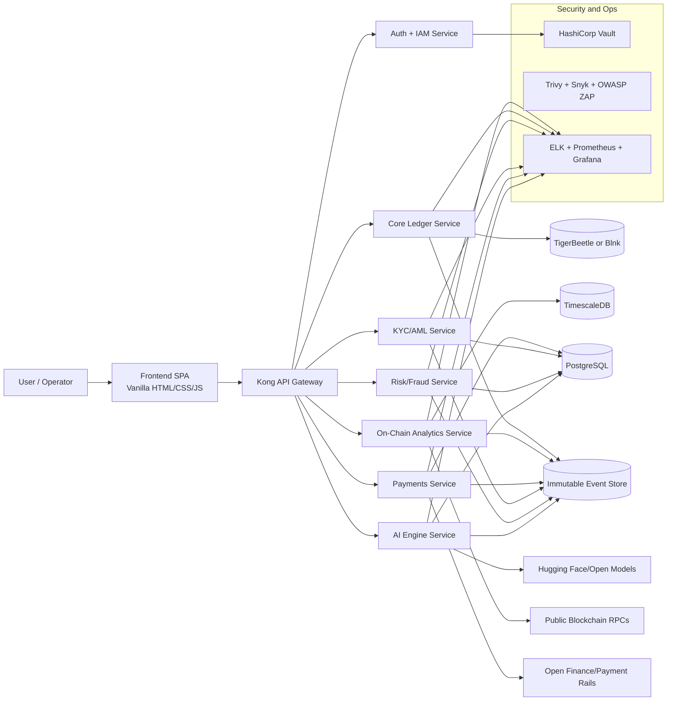

# Wings of Capital


Wings of Capital is an open-source fintech engine and dashboard platform inspired by the Kali Linux philosophy: modular tools, transparent architecture, secure-by-design implementation, and portability across local machines, GitHub Codespaces, Docker, and Kubernetes.

Wings of Capital is copyrighted by Bhargav (2026) and released under Apache 2.0. IPR and copyright are fully claimed and protected.

## Vision

Wings of Capital is not just a website. It is a full fintech platform that combines:

- Crypto intelligence and analytics
- AI-native core fintech services
- Open finance interoperability
- Compliance-first engineering
- Production-grade DevSecOps

## Core Scope

### 1) Crypto Intelligence and Analytics Suite

- Crypto Intelligence Platform (Messari/Token Metrics style)
- On-Chain Analytics (Glassnode/CryptoQuant style)
- AI-Powered Prediction Signals (IntoTheBlock style)
- Market Data Aggregation (CoinMarketCap/CoinGecko style)
- Social and Sentiment Intelligence (LunarCrush/Santiment style)
- Prediction Markets demo interface (Polymarket/Kalshi style)

### 2) Core Fintech Services

- Predictive fraud detection engine
- Instant AI credit scoring
- Automated savings and wealth optimization
- AI-driven micro-loans and lending intelligence
- Stablecoin and tokenized asset gateway
- Digital identity with KYC/AML workflows
- Open banking insights and super-app orchestration

### 3) Non-Functional Requirements

- Fully responsive, accessible UI/UX (mobile-first)
- Zero-trust microservice boundaries
- Shared capabilities: auth, audit, observability, secrets
- CLI-first developer workflow for GitHub Codespaces
- Dockerized, reproducible builds with Terraform-based IaC

## Technology Stack

| Layer | Primary Tools |
|---|---|
| Frontend | Vanilla HTML5, CSS3, JavaScript (ES6+), optional Tailwind CDN |
| Backend | FastAPI, Celery, Redis, PostgreSQL, TimescaleDB |
| AI/ML | PyTorch, Hugging Face OSS models, LangChain, scikit-learn |
| Ledger | TigerBeetle (preferred) or Blnk Ledger |
| Blockchain | web3.py + public RPC endpoints |
| Security | Vault, Trivy, OWASP ZAP, Snyk, STRIDE |
| DevOps | Docker, Docker Compose, Terraform, GitHub Actions |
| Monitoring | ELK Stack + Prometheus + Grafana |
| API Gateway | Kong OSS |

## High-Level Architecture



## Repository Layout (Target)

```text
wings-of-capital/
|-- README.md
|-- IMPLEMENTATION-PLAN.md
|-- LICENSE
|-- docker-compose.yml
|-- terraform/
|-- services/
|   |-- core-ledger/
|   |-- ai-engine/
|   |-- onchain-analytics/
|   |-- payment-gateway/
|   |-- fraud-detection/
|   |-- kyc-service/
|-- frontend/
|   |-- index.html
|   |-- css/
|   |-- js/
|   |-- assets/
|-- shared/
|-- docs/
|-- .github/workflows/
|-- .devcontainer/
`-- scripts/
```

## Quick Start (CLI Only)

```bash
# 1) Clone
git clone https://github.com/Bhargav-2007/Wings-of-Capital.git
cd Wings-of-Capital

# 2) (Optional) System dependencies
sudo apt update
sudo apt install -y tree jq curl

# 3) Review implementation plan
sed -n '1,240p' IMPLEMENTATION-PLAN.md

# 4) Build progressively by phase when instructed
# (Phase 1 begins only after explicit "NEXT TASK" or "PROCEED TO PHASE 1")
```

## API Policy

- Prefer open and free APIs only
- Example sources: CoinGecko, public blockchain RPC endpoints, Hugging Face open models
- Paid proprietary APIs are disallowed unless justified and documented

## Security and Compliance Baseline

- SSDLC executed in 5 phases (see IMPLEMENTATION-PLAN.md)
- STRIDE threat modeling required
- OWASP Top 10 controls integrated
- Zero-trust service-to-service communication
- Immutable event and audit trail strategy
- Regulatory mapping includes RBI/SEBI plus applicable global controls (GDPR, DORA, NIS2, PSD3, PCI-DSS v4.0, EU AI Act where relevant)

## Contribution Guide

1. Fork and clone the repository.
2. Create a feature branch: `git checkout -b feat/your-feature`.
3. Keep changes small, secure, and tested.
4. Follow commit prefixes: `feat:`, `fix:`, `chore:`.
5. Submit a pull request with architecture/security notes.

## License

Licensed under the Apache License 2.0. See LICENSE for details.

Copyright 2026 Bhargav (Wings of Capital). All Rights Reserved.
